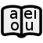
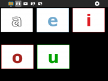
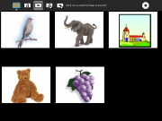

# Activities/AEIOU - Sugar Labs

## About AEIOU

AEIOU is an activity for introducing the Spanish vowels. It displays letters and images and associated sound files, such as 'A as in ave'. There are four modes:

1. Click on the letter to hear its name
2. Click on the picture to hear the name of the first letter in the word represented by the picture
3. Hear a letter name, then click on the corresponding letter
4. Hear a letter name, then click on the corresponding picture

(Also see [I Can Read](https://github.com/sugarlabs/i-can-read-activity), [I Know My ABCs](https://github.com/sugarlabs/iknowmyabcs), and [Letter Match](https://github.com/sugarlabs/lettermatch))

## Where to get AEIOU

The AEIOU activity is available for download from the [Sugar Activity Library](http://activities.sugarlabs.org): [AEIOU](http://activities.sugarlabs.org/en-US/sugar/addon/4626)

The source code is available on [GitHub](https://github.com/sugarlabs/AEIOU).

## Using AEIOU

|  |  |
|---|---|
| Letter game | Picture game |

### Toolbars

Activity toolbar
:  Change the activity name; add notes to the Sugar Journal

Letter mode
: Listen to letter names

Picture mode
: Listen to letter names associated with pictures

Find the letter 1
: Hear a letter spoken and then find it

Find the letter 2
: Hear a word spoken and then find the first letter

Stop button
: Exit the activity

## Learning with AEIOU

While far from contructionist, this activity does provide a mechanism for learning the alphabet.

## Modifying AEIOU

As of Version 1, only a Spanish version is included. In order to add other languages, we need:

* Audio recordings of the letter names.
* Audio recordings of the picture names.
* Perhaps additional pictures, in order ensure there is a picture for each letter of the alphabet.

There is a language-specific database file maintained in ./lessons/??/alphabet.csv where ?? is the 2-digit language code. The format of the CSV file is:

|  letter  |  word  |  color (#RRGGBB) |  image file  |  sound file (image)  |  sound file (letter)  |
|---|---|---|---|---|---|
| R  |  (r)atón  |  #F08020  |  raton.png  |  raton.ogg  |  r.ogg  |

## Extending AEIOU

It would, of course, be fun to let the learner add their own pictures and sound recordings.

## Where to report problems

You are welcome to leave comments/suggestions on the [sugarlabs/AEIOU/Issues](https://github.com/sugarlabs/AEIOU/issues) page.

## Credits

AEIOU was written and is maintained by [User:Walter](https://wiki.sugarlabs.org/go/User:Walter). He was inspired in part by the work of Maria Perez, Fundación Zamora Terán.
